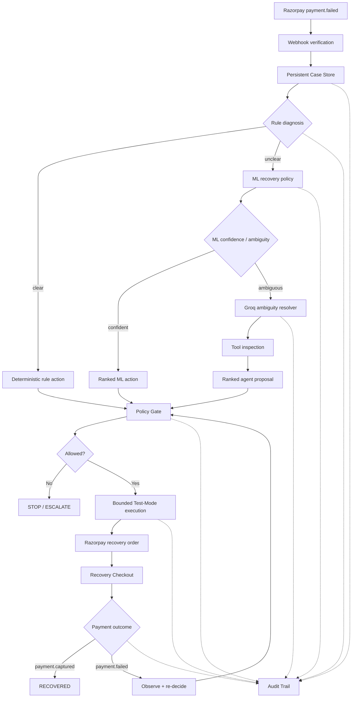
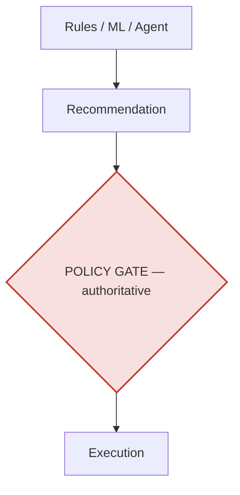
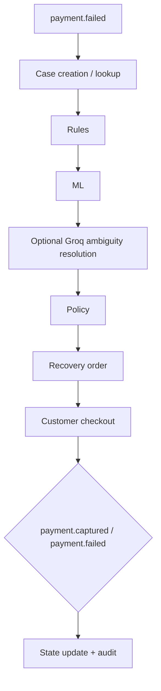

# RecoveryOS Architecture

## Full decision + execution flow

Every stage — rule diagnosis, ML scoring, agent proposal, policy check, execution, and outcome — writes to the audit trail independently, so any decision can be reconstructed after the fact.

---

## Authority boundaries

The agent cannot bypass the policy gate or directly move money. Regardless of which layer proposes an action — a deterministic rule, the ML policy, or the Groq agent — nothing executes until the policy gate independently checks it against bounded-retry, contact-limit, and hard-decline rules.

---

## Live Razorpay flow

---

## Bounded recovery behavior

A recovery episode is **intentionally bounded** — repeated failures do not create an unbounded retry loop.

Case state tracks:
- Actions already attempted this episode
- Terminal status (`RECOVERED`, `STOPPED`, `ESCALATED`)

...so policy decisions survive separate webhook deliveries and process restarts. A case that fails twice re-enters the same decision path on its next webhook event rather than starting a fresh, unbounded retry sequence.

---

## Why this shape

| Layer | Why it exists here, and not elsewhere |
|---|---|
| **Rules first** | Clear cases (hard declines, expired methods) don't need probabilistic reasoning — a lookup is faster, cheaper, and fully auditable |
| **ML second** | Recovery probability is a genuine prediction task under uncertainty — this is where a learned model adds real, measured value over both naive and rule-based baselines |
| **Agent last, and selective** | Reserved for the ambiguous minority where ML's confidence is low or rules/ML disagree — invoking an LLM on every case would add cost without proportional benefit |
| **Policy gate always authoritative** | Deterministic and auditable by design — an LLM deciding "should we stop retrying" would be less predictable and harder to defend than a fixed rule, so this layer is never delegated to AI |

This ordering is a direct answer to the brief's own grading line: *"AI judgment: the right tool in the right place, and where you chose not to use one."*