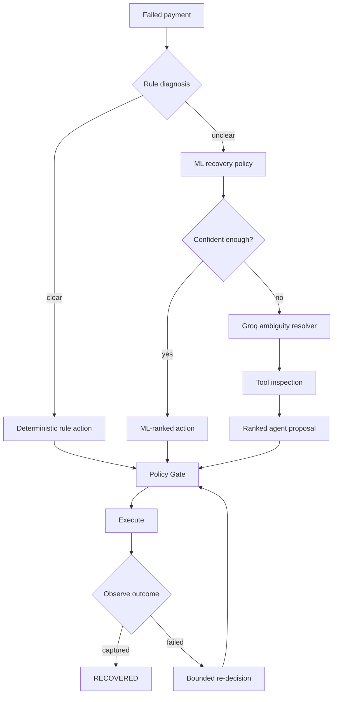
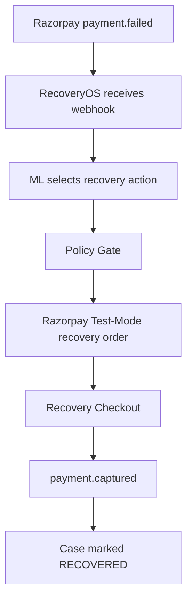
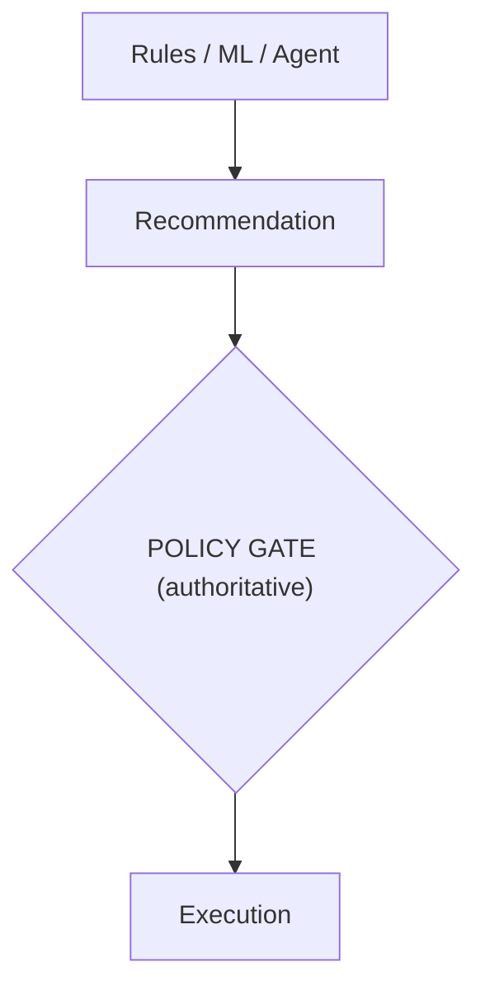

# RecoveryOS

**AI Revenue Recovery for Razorpay** — Track 03, Razorpay AI Buildathon

RecoveryOS is a selective AI revenue-recovery system for failed payments. It does not blindly retry every failure. Instead it combines deterministic rules, a learned recovery policy, a selective LLM ambiguity resolver, a hard policy gate, bounded Test-Mode execution, and event-driven observation — so every money-moving action is explainable, bounded, and auditable.

> **The agent is not the execution authority.** Any money-moving action must pass the deterministic policy gate.

---

## The core idea



---

## What it demonstrates

| Capability | Status |
|---|---|
| Razorpay Test Mode `payment.failed` webhook handling | ✅ |
| HMAC webhook signature verification | ✅ |
| Webhook event-id idempotency | ✅ |
| Rules → ML → selective Agent decision flow | ✅ |
| Economic action ranking (expected recovery value − intervention cost) | ✅ |
| Hard policy constraints and stopping rules | ✅ |
| Durable SQLite case state | ✅ |
| Recovery-order creation in Razorpay Test Mode | ✅ |
| Recovery Checkout → `payment.captured` → `RECOVERED` | ✅ |
| Full audit logging of decisions, execution, and outcomes | ✅ |
| Automated tests | ✅ |
| Live demo | ✅ |

---

## Live Razorpay flow



A second failure on the same recovery episode re-enters the decision path and is bounded by the recovery policy — no unbounded retry loops.

---

## AI architecture

### 1. Rules
Clear cases are handled deterministically — known expired payment methods, insufficient-funds conditions, and other unambiguous failure codes.

### 2. ML recovery policy
For ambiguous cases, the model estimates recovery probability per allowed action and ranks them economically:

```
Expected net value = P(recovery) × payment amount − intervention cost
```

Evaluated on a controlled synthetic benchmark with customer-level splits and noisy features.

### 3. Selective agent
The LLM is a **fallback for genuinely ambiguous ML decisions only**. It inspects tool-provided context and returns a ranked proposal — it cannot execute payments or bypass policy. Provider: Groq (real), with a deterministic mock provider for tests.

### 4. Policy gate
The authoritative layer. Enforces:
- Bounded episode retries
- Contact limits
- Duplicate-action protection
- Hard-decline restrictions

### 5. Execution and observation
Test Mode execution creates recovery orders — order creation is never falsely treated as recovered revenue. A later Razorpay event closes the loop:

```
payment.captured → RECOVERED
payment.failed   → bounded re-decision / stop
```

---

## Authority boundaries



The agent cannot bypass the policy gate or directly move money.

---

## Evaluation

Repeated-seed synthetic benchmarking across five policies: naive retry, strong rules, ML recovery policy, agent proxy, and a sequential oracle.

> **Important:** these are controlled synthetic benchmark results, not production Razorpay recovery rates.

| Policy | Recovery rate | Lift over naive |
|---|---:|---:|
| Naive retry | 18.3% | — |
| Strong rules | 49.2% | +30.9 pp |
| **ML recovery policy** | **56.6%** | **+38.3 pp** |
| Evaluator-only oracle | 66.4% | +48.1 pp |

ML delivers a **+7.4 percentage-point lift over the strong-rule baseline** and a **+38.3 pp lift over naive retry** on the one-step benchmark — the clearest, most defensible evidence that the AI layer earns its place.

The agent benchmark is reported separately: it's an **ambiguity-resolution mechanism**, not a claim of incremental recovery uplift. We deliberately did not force this result — see the methodology note in `ARCHITECTURE.md`.

---

## What broke, and how it was fixed

| Issue | Fix |
|---|---|
| **Webhook payload nesting** — initial parser expected the wrong shape | Corrected to read the payment entity from `payload.payment.entity`, matching Razorpay's live event structure |
| **Webhook URL mismatch** — Cloudflare Quick Tunnel received traffic on `/`, producing 404 | Corrected the webhook target to `/webhooks/razorpay` |
| **Persistent test state** — once durable SQLite state was introduced, fixed test IDs survived across test runs | Cleared the stale local database during integration testing; kept the persistence implementation itself |
| **Recovery observation** — needed to verify the event-driven loop closes correctly | Confirmed `payment.captured → CASE_UPDATE → status=RECOVERED` end-to-end |
| **Agent execution authority** — ensuring the LLM never gets to move money | Verified the real Groq provider path is selective-only; policy gate remains authoritative regardless of agent output |

**Live Test-Mode evidence:**
```
payment.failed → request_alternate_method → recovery order created
→ Recovery Checkout → payment.captured → RECOVERED
```
The system also demonstrated a failed recovery attempt returning to the decision layer and selecting `retry_later`.

---

## Repository structure

```
RecoveryOS/
├── benchmark/
├── src/
│   └── recoveryos/
│       ├── agent/
│       ├── audit/
│       ├── domain/
│       ├── engine/
│       ├── evaluation/
│       └── integrations/
├── tests/
├── README.md
├── ARCHITECTURE.md
├── RAZORPAY_TESTMODE_RUNBOOK.md
├── requirements.txt
├── pyproject.toml
├── .env.example
└── .gitignore
```

---

## Run locally

**1. Install**
```powershell
python -m venv .venv
.\.venv\Scripts\Activate.ps1
pip install -r requirements.txt
```

**2. Configure environment**

Create `.env` from `.env.example` — never commit `.env`.

```
RAZORPAY_KEY_ID=rzp_test_...
RAZORPAY_KEY_SECRET=...
RAZORPAY_WEBHOOK_SECRET=...
RAZORPAY_EXECUTION_ENABLED=true
```

For the optional real Groq provider:
```
RECOVERYOS_AGENT_PROVIDER=groq
GROQ_API_KEY=...
GROQ_MODEL=llama-3.3-70b-versatile
```

**3. Run tests**
```powershell
$env:PYTHONPATH="src"
pytest -q
```

**4. Start the service**
```powershell
$env:PYTHONPATH="src"
python -m uvicorn recoveryos.integrations.webhook_app:app --reload --port 8000
```

| Endpoint | Purpose |
|---|---|
| `GET /health` | Service + agent status |
| `GET /dashboard` | Live case view |
| `POST /webhooks/razorpay` | Razorpay event ingestion |

---

## Demo video

📹 5-minute pitch video: *[add final unlisted/public link here]*

## Architecture

Full system design: [`ARCHITECTURE.md`](./ARCHITECTURE.md)

## Status

RecoveryOS is a **Test-Mode prototype** demonstrating the complete bounded recovery loop. It is not a production payment-recovery service.